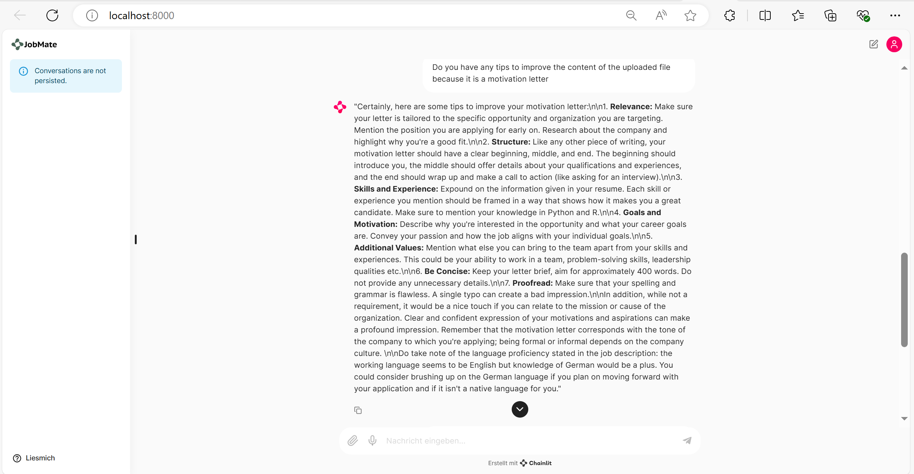
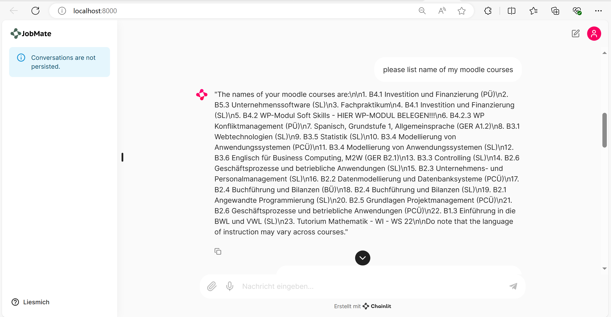
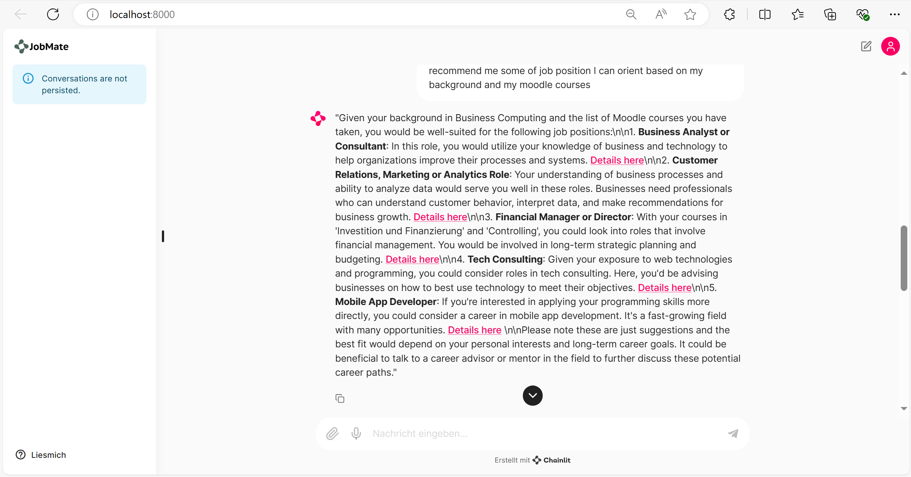
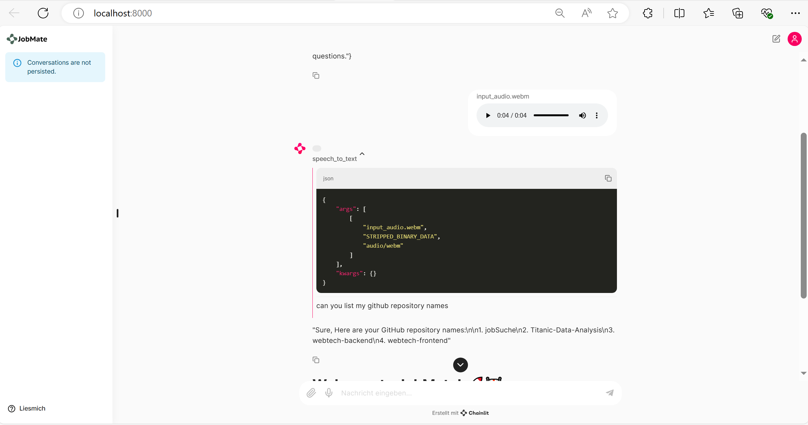

# Results

### 1. Upload CV as a PDF file

#### Before uploading CV
We need to upload a PDF file to start the chat

#### After uploading file
A message confirms that the PDF file has been uploaded. In the following screenshot, if you don't mention the CV is the uploaded file,
the AI can not process the PDF File

### 2. Read PDF file/Extract details from CV + Optimization

#### Extract all infos in PDF File

#### Extract details about my background
**- Option 1:** 

**- Option 2:** 

#### Motivation Letter evaluate + optimize
The response sounds a little bit general, maybe we need to give it more context like prompt our request more detailed. 

### 3. GitHub Integration
By setting the GitHub Token as an environment variable, users can access their public repositories and retrieve content from any of their repositories.

#### List of all repository name

#### Retrieve content of a given repo and ask about repo

### 4. Moodle Courses
By setting the Moodle Token as an environment variable, users can retrieve name of their enrolled courses in Moodle

**Option 1**

**Option 2**

### 5. Job Description Analysis
Based on your given URL, JobMate can analyze the job description and give advice for your skill development

#### Extract content of the job description from a given URL

#### Evaluate your skills based on the job description

#### Advice of JobMate for your skill development

After uploading your CV file and telling AI about your enrolled Moodle course or GitHub repos,
you can request AI's advice for career orientation and AI will recommend you some suitable job positions based on your skills
#### Option 1: The AI's answer is not very right, maybe we need to give a specific context

#### Option 2: Better Answer based on request with more specific context

### 6. Interview Preparation
Based on your uploaded resume and provided job description URL, 
JobMate will generate a list of potential interview questions

### 7. Speech to Text Example

# Insights

Overall, our AI is capable of performing all the desired functions, but there is significant room for future development.

Currently, the AI requires user requests to retrieve content from GitHub or Moodle before any queries can be made. It does not automatically access this content.

The response time is somewhat slow. Based on my research, this can be improved using streaming. However, we face challenges implementing this within our current structure and OpenAI Assistant. 
Most available solutions demonstrate streaming on the frontend, whereas our setup involves a separate backend connected to the frontend through Chainlit and FastAPI. 
This also complicates handling file attachments in messages, as locating the file path becomes problematic.

Additionally, due to the token limit that OpenAI can process, our AI occasionally encounters an "Internal Server Error" message. 
For example, functions such as `get_moodle_course_content` and `scrape_careerjet` face this error, although they can still run alone. 
We might address this by restructuring the return value in the methods to include only useful content and remove unnecessary information. 
We also tried saving all information related to enrolled courses in ChromaDB, but the query results were not concise, so we removed it. 
For the `scrape_careerjet` function, we faced similar issues: we could get job lists from the website but could not integrate them into our AI.

Moreover, we aimed to create different assistants for function callings based on user messages. 
However, implementing multiple assistants to process the same thread or runs proved difficult. 
Finally, we decided to implement all function callings in one assistant to ensure that our AI would work. 
This approach may lead to higher costs.

During our project, we switched between GPT-4 and GPT-3.5. The responses from GPT-4 were better and more logical, so we used it for our assistant. 
However, we used GPT-3.5 for implementing function callings to save costs and switched to GPT-4 after completing the code.

Despite the challenges, we have learned a lot from this project. 
In the future, we could explore implementing our AI models with other tools, such as open-source AI models, different databases, or alternative user interfaces instead of Chainlit. 
This project has been a valuable learning experience, and we are excited about the potential future improvements and innovations we can bring to our AI.