# Results

### 1. Upload CV as a PDF file**

#### Before uploading CV
We need to upload a PDF file to start the chat

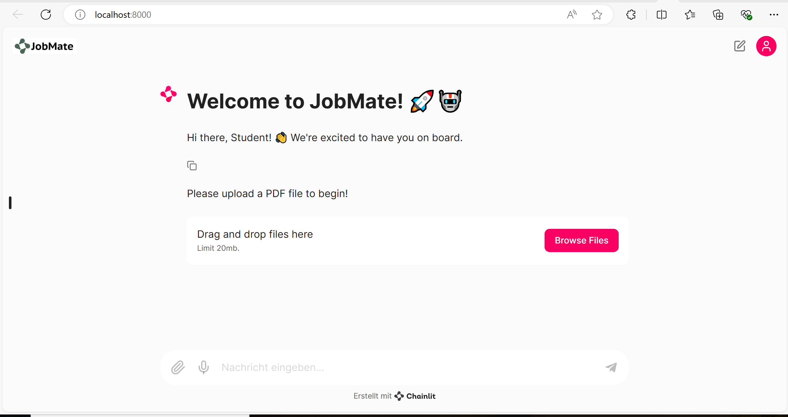

#### After uploading file
A message confirms that the PDF file has been uploaded. In the following screenshot

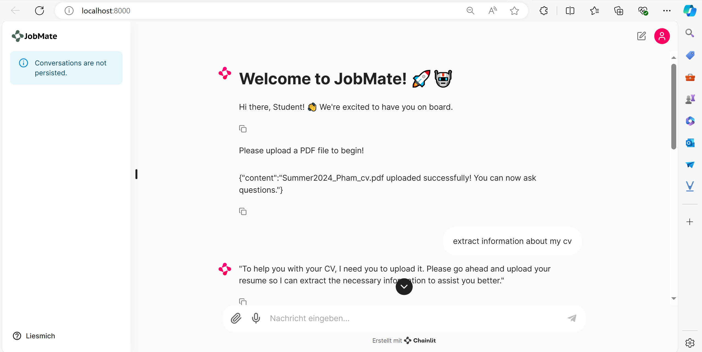

### 2. Read PDF file/Extract details from CV

#### Extract all infos in PDF File
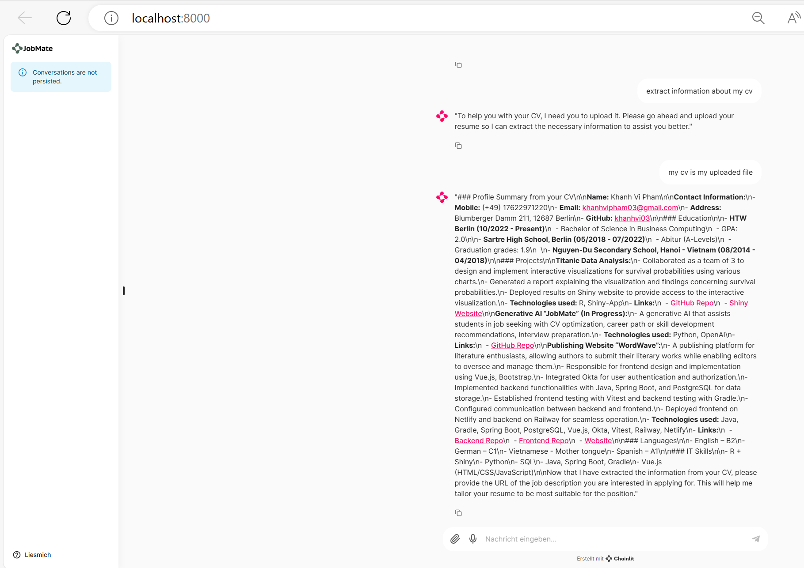

#### Extract details about my background
**- Option 1:** 
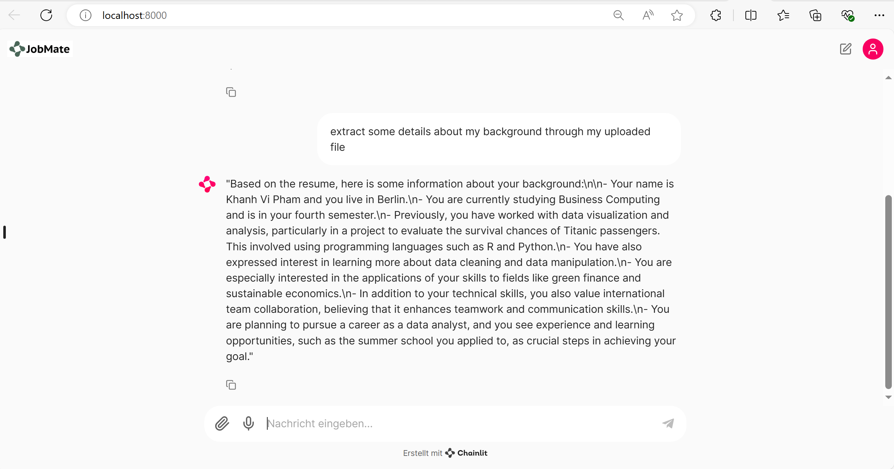

**- Option 2:** 
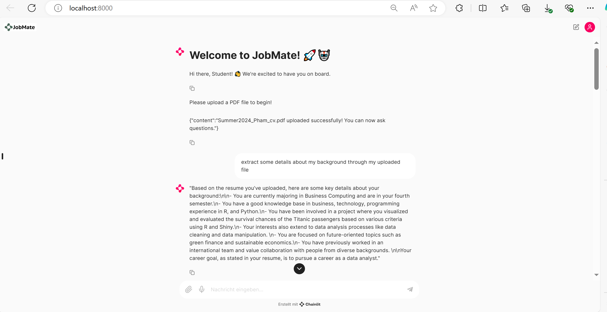

### 3. GitHub Integration
By setting the GitHub Token as an environment variable, users can access their public repositories and retrieve content from any of their repositories.

#### List of all repository name
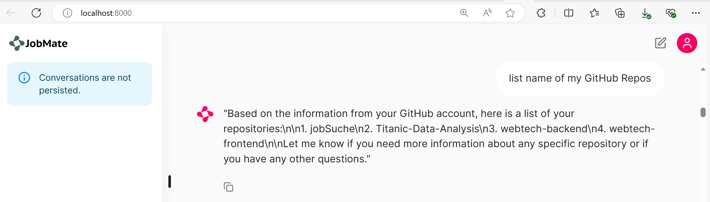

#### Retrieve content of a given repo and ask about repo

### 4. Moodle Courses
By setting the Moodle Token as an environment variable, users can retrieve name of their enrolled courses in Moodle
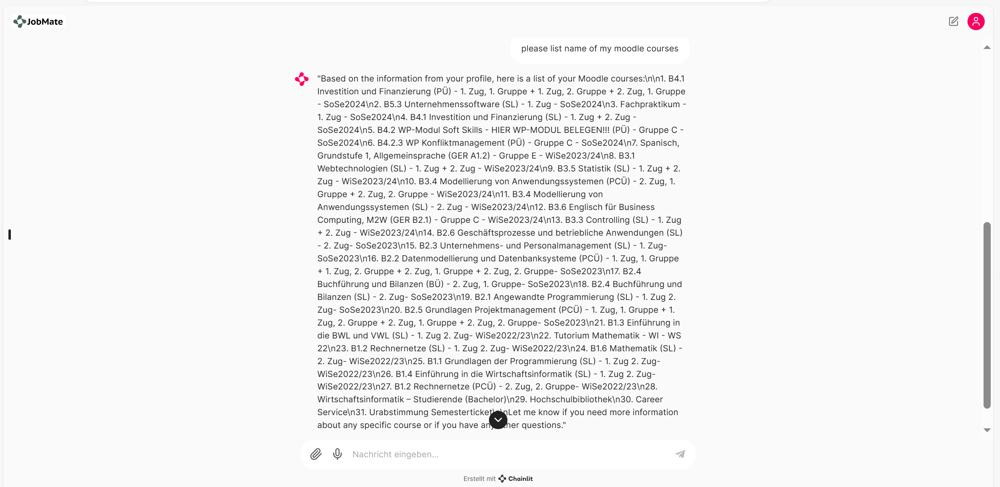

### 5. Job Description Analysis
Based on your given URL, JobMate can analyze the job description and give advice for your skill development

#### Extract content of the job description from a given URL
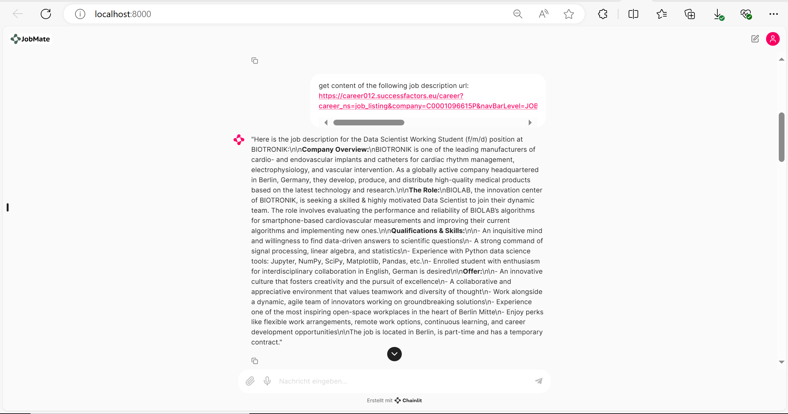

#### Evaluate your skills based on the job description
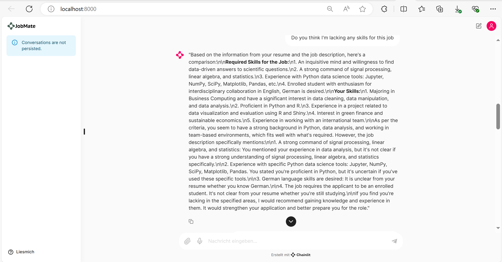

#### Advice of JobMate for your skill development
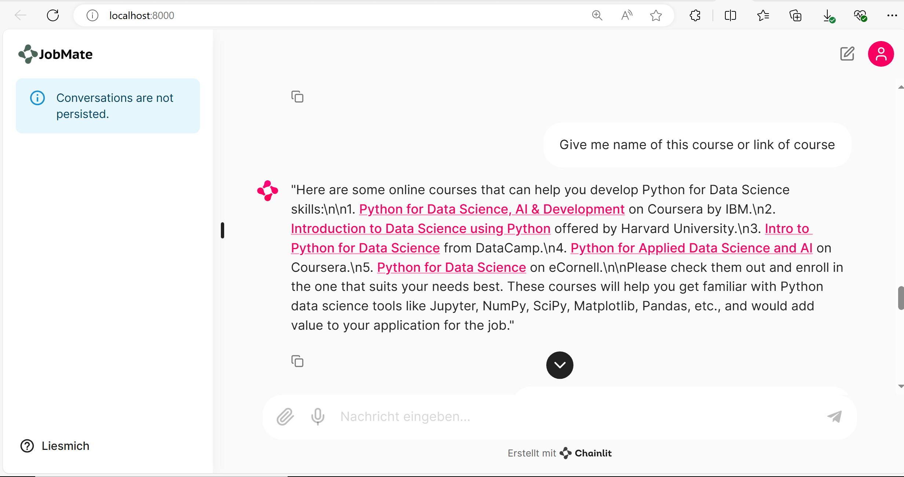

#### Advice for career orientation, but the AI's answer is not very right, maybe we need to give a specific context
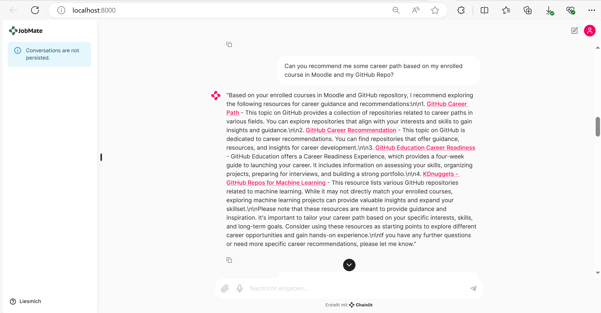

### 6. Interview Preparation
Based on your uploaded resume and provided job description URL, 
JobMate will generate a list of potential interview questions

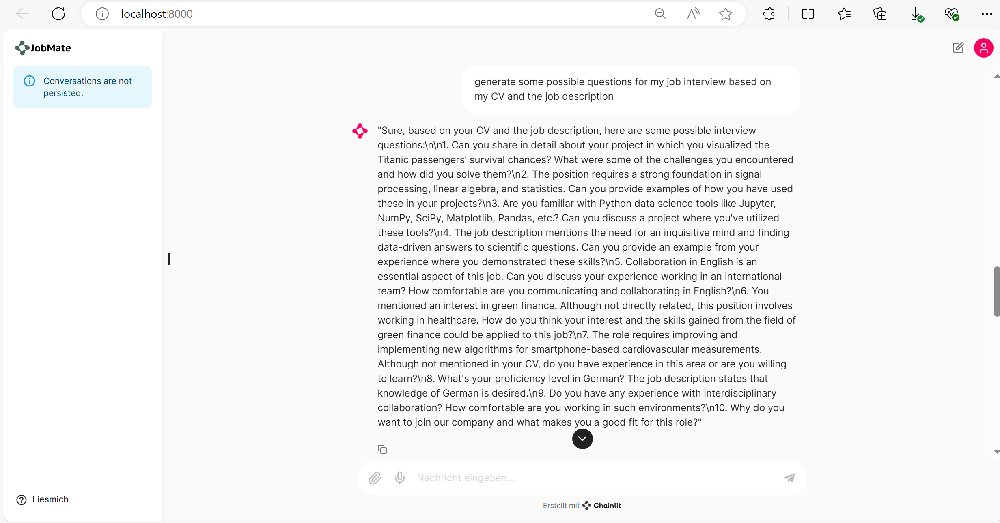

# Insights

Overall, our AI is capable of performing all the desired functions, but there is significant room for future development.

Currently, the AI requires user requests to retrieve content from GitHub or Moodle 
before any queries can be made to ask about this content. It does not automatically access the content on its own.

The response time is somewhat slow. Based on my research, this can be improved using streaming. 
However, we face challenges implementing this within our current structure and OpenAI Assistant. 
Most available solutions demonstrate streaming on the frontend, whereas our setup involves a separate backend connected to the frontend through Chainlit and FastAPI. 
This disparity also complicates handling file attachments in messages, as locating the file path becomes problematic.

Additionally, due to the token limit that OpenAI can process, our AI occasionally encounters an "Internal Server Error" message. 
For example, our functions such as "get_moodle_course_content" and "scrape_careerjet" face this error, although it can still run alone.