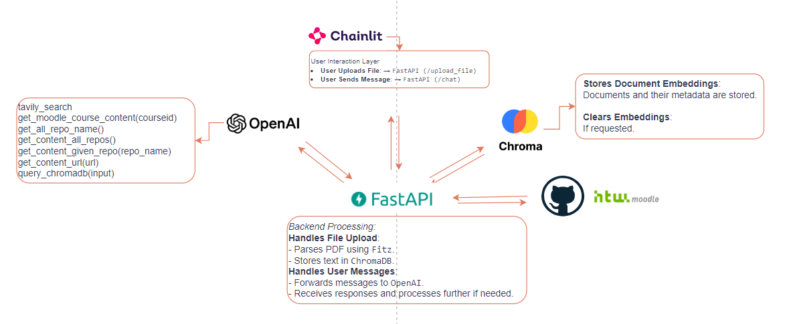

# JobMate - Generative AI for Career Navigator
**JobMate** is designed to streamline the job application process for students, providing a comprehensive suite of tools that cater to various aspects of their career journey.😊

### 📂 Guideline

- **Create Assistant**: Run `jobmate_agent.py` in setup/jobmate_agent.py
- **Backend**: Run `main.py` in BE/main.py
- **Frontend**: Run `app.py` in FE/app.py
- **Documentation**: Open `Results.md` in Documentation/Results.md

### 🚀 Key Features

#### 1. Career Consulting + CV Optimization

JobMate can connect with Moodle and GitHub to access course details as well as your GitHub Repos. It gives you advice about your career path based on your coursework, coding projects and skills to better prepare for job applications.

Simply upload your resume in PDF format, and JobMate will parse and analyze the content. This feature helps in highlighting key information, ensuring that your resume is optimized and ready for job applications. JobMate can also provide suggestions for improvements, making sure your resume stands out to recruiters.

#### 2. Job Description Analysis

By providing a job description URL, JobMate can extract and analyze the job requirements. It offers personalized advice on optimizing your resume, identifying missing skills, and suggesting relevant courses to improve your qualifications. Additionally, it prepares you for interviews by highlighting the essential skills and experiences required for the job.

#### 3. Interview Preparation:
JobMate can generate potential interview questions based on the job description and your resume. It provides answers and tips for each question, ensuring your responses align with your skills and experiences, helps you practice and build confidence for your interviews.

#### 4. Speech to Text:
You can interact with JobMate effortlessly by speaking your queries besides typing.

### How It Works

#### 📚 Moodle Integration:
- Connect your Moodle account to JobMate through your Moodle Token
- Browse through your enrolled courses and access detailed content effortlessly

#### 📦 GitHub Integration:
- Connect your GitHub account to JobMate through your GitHub Token
- Review information about your repositories, helping you manage and present your projects better

#### 📝 Resume Optimization:
- Upload your PDF resume to the AI Assistant
- Receive a detailed analysis of your resume with suggestions for improvement, ensuring it aligns with job requirements

#### 💻 Job Description Analysis:
- Extract content of job description from your given URL
- Receive advice on how to enhance your resume and skillset

#### 💡 Interview Preparation:
- Upload your resume and provide the job description URL.
- JobMate will generate a list of potential interview questions specific to the job role
- Review the suggested answers and tips provided by JobMate to ensure your responses are relevant

### ⚙️ Project Structure

**1. AI Integration:**
OpenAI Assistant is used to solve the chosen problem. Function calling mechanisms are implemented to handle tools from getting all GitHub repos to retrieving all enrolled courses in Moodle dynamically based on the application's needs.

**2. Backend Development:**
- File agent.py incorporates function calling to dynamically select and use different tools or services based on user interactions or data inputs. 
Many functions with integrations of third-party tools such as GitHub, Moodle and user URL are also implemented here.
- File main.py handles API endpoints to process user message with AI or user's uploaded file and send it back to frontend.
- File app.py gets user's message or upload file and send it to backend while awaiting AI-generated responses.
- Backend and frontend code will be interacted with each other through using FastAPI

**3. Database Integration:**
ChromaDB is implement as a vector database to manage uploaded files and dynamically generate query responses 
or database entries based on the context provided by AI-driven analysis.

**4. Interface Development:**
Chainlit is used to develop an user interface that is intuitive and caters to the needs of the end-users. 
The interface allow users to interact with the AI functionalities effortlessly by speaking your queries besides typing.
